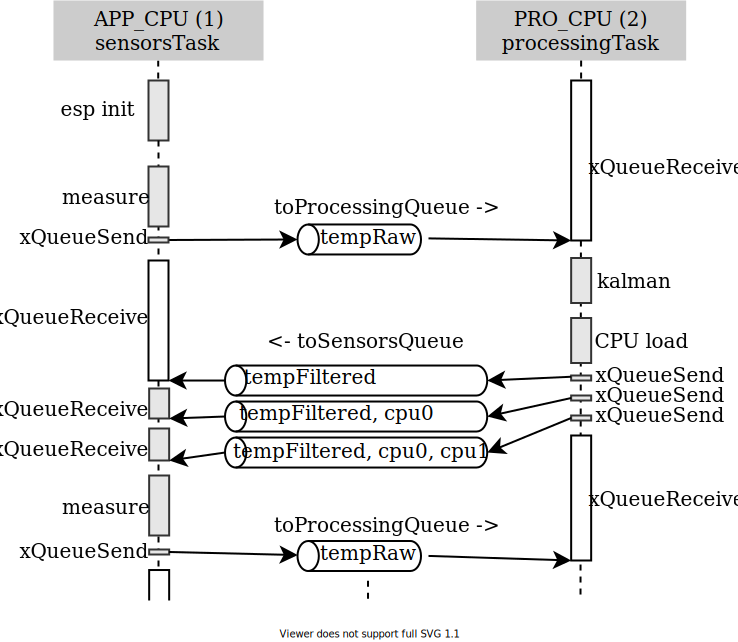
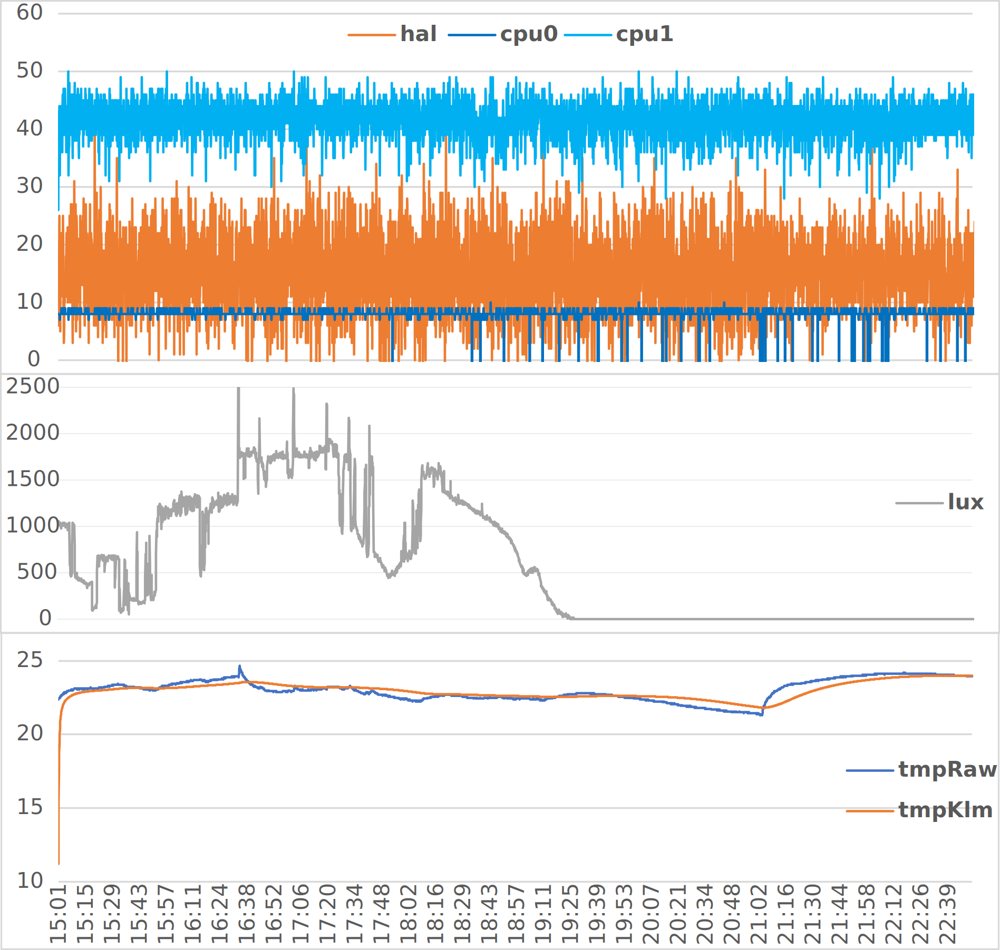
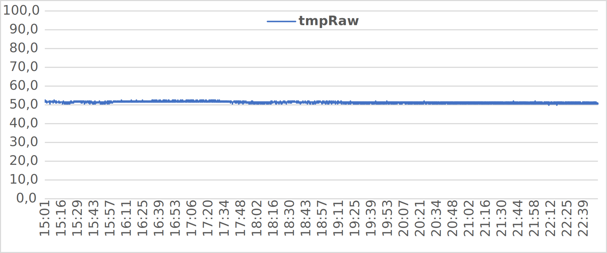

# TOI 2020/2021 - Projekt 1
Bc. Vladan Kudláč – xkudla15  
8. 4. 2021

## Instalace na Raspberry

 - python3.7 (tested)
 - pip3.7 install --upgrade "aiocoap[all]"

## ESP32
Po spuštění jsou vytvořeny 4 tasky. Na CPU0 (`PRO_CPU`) běží Kalmanův filtr a vyhodnocování vytížení CPU a na CPU1 (`APP_CPU`) inicializace zařízení, získávání hodnot ze senzorů a odesílání dat. Další dva tasky, na každém jádru jeden, slouží k sledování vytížení CPU. 

### Počáteční konfigurace
Před spuštěním je potřeba upravit konfiguraci.
Všechny proměnné se nastavují v konstantách v hlavičkových souborech:

 - `wifi.h`: `EXAMPLE_ESP_WIFI_SSID` a `EXAMPLE_ESP_WIFI_PASS` pro připojení (nutné nastavit)
 - `coap.h`: `COAP_URI` serveru (nutné nastavit)

### Fáze spouštění
Zařízení ESP32 se po zapojení k napájení připojí na WiFi. ESP provede 10 pokusů o připojení, poté pokračuje dále. Inicializuje se AD převodník 1, na čtení hodnoty z analogového vstupu `IO34` z fotorezistoru. Používá se 12 bitová sběrnice, maximální napětí na vstupu je 2,6 V. Dále se inicializuje komunikace se serverem. To zahrnuje překlad doménového jména serveru na adresu. Pokud překlad selže, zařízení se restartuje, v případě jiné chyby se pokračuje dále. V případě úspěchu je navázáno spojení. Za další se inicializuje čtení hodnoty z teplotního čidla DS18B20 z portu `IO04`. Program předpokládá nalezení právě jednoho zařízení na sběrnici. Sběrnice je 12 bitová, rozlišení odpovídá 0,083 °C, vyšší není podporováno. Při implementaci jsem narazil na problém, kdy inicializace sběrnice a čtení v cyklech musí probíhat ve stejné funkci. Pokud jsem inicializaci a čtení rozdělil, nefungovalo čtení po použití `vTaskDelay`.

Pokud proběhla inicializace DS18B20 a CoAP klienta úspěšně, přejde ESP do fáze měření. Pokud jedna z těchto inicializací skončila chybou, je zařízení restartováno.

### Fáze měření
Nejprve se získá hodnota z fotorezistoru v intervalu <0, 4095> přečtením z ADC1 pomocí `adc1_get_raw()`. Hodnota 0 značí tmu/šero, hodnota 4095 dopadající přímé světlo. Poté se přečte hodnota v rozmezí <0, 4095> z Hallovy sondy pomocí `hall_sensor_read()`. Poté se načte teplota z DS18B20 pomocí kódu z 1. laboratorního cvičení.

Po naměření všech hodnot, zaznamená aktuální čas v zařízení, který připojí k datům. ESP používá čas od startu systému, aktuální čas v UTC by muselo zařízení získávat pomocí [SNTP klienta](https://github.com/espressif/esp-idf/tree/master/examples/protocols/sntp).

Následně zašle druhému CPU naměřenou teplotu (typu `float`) pomocí sdílené fronty `toProcessingQueue` o kapacitě 1. Druhé CPU použije jednoduchý Kalmanův filtr, získá hodnotu vytížení CPU0 a CPU1 od posledního měření a pošle 3 hodnoty typu `float` pomocí `toSensorsQueue` o kapacitě 3 zpět do předchozího CPU. První hodnota je filtrovaná teplota, druhá hodnota vytížení CPU0, třetí je využití CPU1.

Původní CPU sestaví datový řetězec, např. `time=1970-00-01 02:36:34;tmpRaw=22.812;tmpKlm=23.171;lux=839;hal=12;cpu0=8;cpu1=40;dev=espXKUDLA15` a odešle jej pomocí *POST* metody na server. Zprávy jsou typu *CONFIRMABLE*, v případě ztráty nebo výpadku serveru jsou ukládány do fronty a poté po dávkách posílány na server (vždy po naměření hodnot). Proto jsou ke zprávám připojeny časy měření. Klient je schopen překlenou i 15 minutový výpadek serveru, časy měření budou na rozdíl od času přijetí rovnoměrně rozložené a čas měření v UTC lze odvodit z předchozích přijatých zpráv. CoAP klient podporuje IPv6. Šifrování sdíleným klíčem je připravené ale nenasazené. ESP měří a odesílá data přibližně každých 6 sekund.

Komunikaci mezi CPU znázorňuje následující diagram:  

### Měření využití CPU
Měření využití CPU je vypočtené jako poměr času, kdy je procesor *zaneprázdněn* vůči uplynulému času. Měření *zaneprázdněnosti* CPU je řešeno pomocí tasků s nízkou prioritou pro každé z CPU. Pokud CPU nemá na práci zpracování nebo měření hodnot, začne vykonávat tuto nízko-prioritní úlohu. Úloha si nejprve poznačí aktuální čas a poté se uspí na 0 ms. CPU začne vykonávat úlohu s vyšší prioritou a k nižší prioritě se vrátí později. Po probuzení task porovná čas před uspáním a po probuzení. Rozdíl je dobou, po kterou bylo CPU zaneprázdněno vysoko-prioritní úlohou. Tuto dobu procesy akumulují pro každé CPU.

Vyhodnocení provede úloha s vysokou prioritou na CPU0 po Kalmanově filtru, která po vyhodnocení vynuluje naakumulované hodnoty a poznačí si čas, kdy proběhlo poslední vyhodnocení vytížení CPU.

## Raspberry
Část běžící na Raspberry se skládá ze dvou skriptů - `server.py` a `client.py`. Skripty lze spouštět a zastavovat nezávisle.

### Serverová část
Server ukládá všechna přijatá měření do souboru `data.csv`. Server k přijatému požadavku přidá čas přijetí (`receive time`), čas měření označí jako `measurement time`. První řádek CSV obsahuje názvy sloupců. Jako oddělovač hodnot slouží středník. Server využítá vestavěné knihovny `csv`, soubor je otevřen po celou dobu běhu programu. Ukončením skriptu (např. CTRL+C) dojde k uzavření souboru. Server nezapisuje do souboru ihned po přijetí požadavku, ale po dávkách. Ukončením programu dojde k zapsání všech dosud nezapsaných dat. Pokud soubor `data.csv` již při startu serveru existuje, obsah souboru je před spuštěním smazán.

### Klientská část
Klient provede každých 5 sekund měření, připojí aktuální čas a spolu s identifikátorem pošle výsledky na `localhost`. Teplota na čipu Raspberry je získána příkazem `vcgencmd measure_temp`. Při chybě přenosu nedochází ke znovuzaslání.

## Komunikace se serverem
Komunikace probíhá pomocí metody *POST*, potvrzovaným typem zpráv (*CON* a *ACK*). URI odkazuje na kořenový dokument, například: `coap://lepton.lan`, v případě Raspberry pak `coap://localhost`. Tělo zprávy obsahuje *položky* oddělené středníkem. Za poslední položkou středník není. Jednotlivé položky se skládají z klíče a hodnoty, formát `klic=hodnota`. Server podporuje položky s následujícími *klíči*:

 - `measurement time` - lokální čas zařízení v době změření hodnot ve formátu *YYYY-MM-DD hh:mm:ss*
 - `dev` - identifikátor zařízení (např. *espXKUDLA15*)
 - `tmpRaw` - nefiltrovaná teplota
 - `tmpKlm` - teplota po aplikování Kalmanova filtru
 - `lux` - intenzita osvětlení
 - `hal` - intenzita magnetického pole
 - `cpu0` - vytížení CPU0
 - `cpu1` - vytížení CPU1

Položky s výše neuvedeným klíčem jsou serverem zahozeny. Všechny položky jsou volitelné, chybějící položky mají v CSV prázdnou hodnotu.
Příklad zprávy z Raspberry: `time=2021-04-08 20:30:08;tmpRaw=50.5;dev=rpiXKUDLA15`.

## Vizualizace dat
Data z jednotlivých zařízení je možné filtrovat pomocí sloupce *dev* nástrojem *Automatický filtr* a vizualizovat programem *Excel* nebo *Calc*.
Následující data byla naměřena 8. 4. 2021 v čase 15:00 až 22:50 (západ slunce v 19:30). Jedná se o 9 694 naměřených hodnot (658 kB dat).

### Data z ESP32

### Data z Raspberry

## Použité knihovny

### Kalmanův filtr
Implementace je založena na *Kalman Filter implementation for single variable models*.  
MIT License, Copyright (c) 2017 Denys Sene  
<https://github.com/denyssene/SimpleKalmanFilter>

### ESP32 WiFi
Implementace je převzatá z prvního cvičení a je založená na *WiFi station Example*.  
Public Domain or CC0  
<https://github.com/espressif/esp-idf/blob/master/examples/wifi/getting_started/station/main/station_example_main.c>

### ESP32 Coap klient
Implementace vychází z *CoAP client example*, oproti ní je velmi zjednodušena, vynecháno je šifrování pomocí certifikátů.  
Public Domain or CC0  
<https://github.com/espressif/esp-idf/tree/master/examples/protocols/coap_client>

Klient používá knihovnu *libcoap*.  
Simplified BSD License, Copyright (c) 2010--2021, Olaf Bergmann and others. All rights reserved.  
<https://github.com/obgm/libcoap>

### Raspberry CoAP server a klient
Protokol CoAP je jak v serverové části, tak v klientské části řešen pomocí knihovny *aiocoap*.  
MIT License, Copyright (c) 2012-2014 Maciej Wasilak <<http://sixpinetrees.blogspot.com>>, 2013-2014 Christian Amsüss <<c.amsuess@energyharvesting.at>>  
<https://github.com/chrysn/aiocoap>

### ESP32 vytížení CPU
Myšlenka měření a část kódu vychází z *ESP32 CPU load test without special configuration*  
Public Domain or CC0  
<https://github.com/pglen/esp32_cpu_load>
